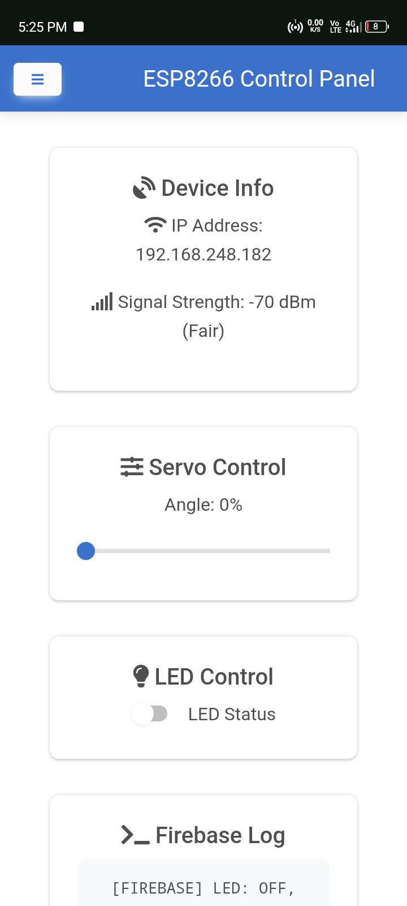
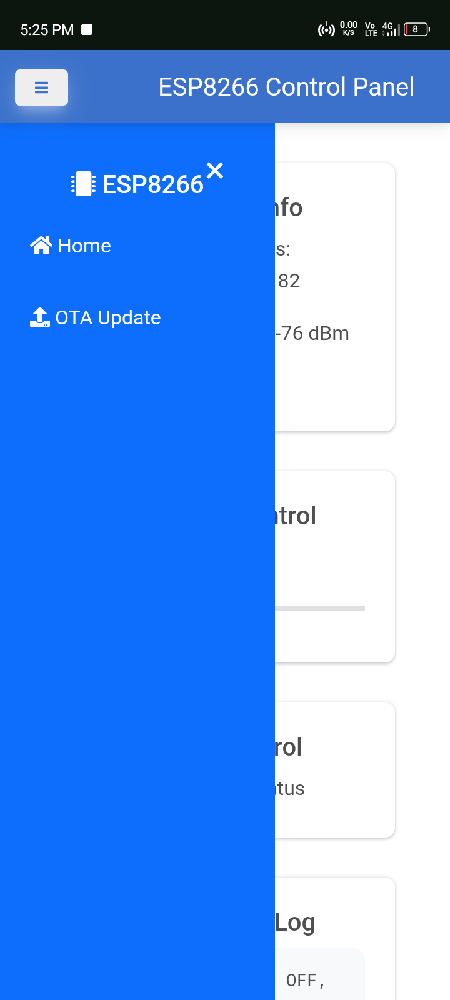
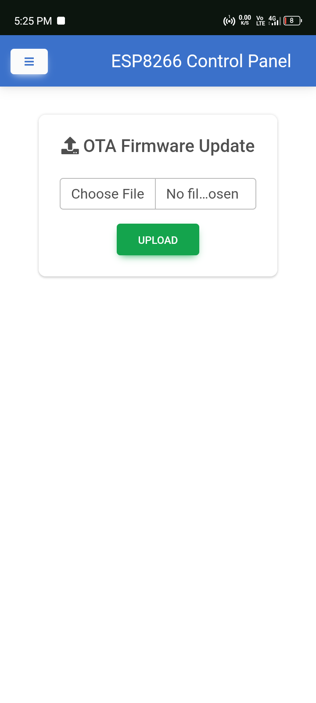
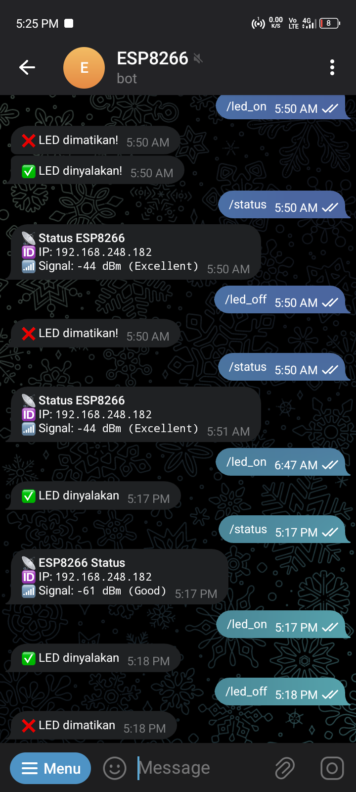

[](https://github.com/kajukopi/esp8266wifi12e/releases)


# 🚀 ESP8266 Web Control + Firebase + OTA + Telegram

Proyek ini mendemonstrasikan **ESP8266 Web Panel** modern yang dapat dikontrol melalui **browser, Firebase Realtime Database, dan Telegram Bot**. Sistem ini cocok digunakan untuk otomasi rumah, monitoring jarak jauh, dan pembelajaran IoT.

## 🔥 Fitur Terbaru (Setelah Update)

- ✅ **Firebase Realtime Database**: Sinkronisasi otomatis LED & Servo ke database cloud
- 🌐 **UI modern** berbasis HTML + MDBootstrap + FontAwesome (tanpa library tambahan)
- 💡 **Kontrol LED** real-time via browser, Firebase, atau Telegram
- 🎚️ **Kontrol Servo** dari UI atau Firebase (0–100%)
- 🔄 **OTA Firmware Update** langsung dari web UI
- 📋 **Log Panel**:
  - 📡 Log dari ESP8266
  - ☁️ Log Firebase: setiap perubahan `led` atau `servo`
- 🤖 **Telegram Bot Control**: /led_on, /led_off, /servo_50, /status
- 🛠️ **CI/CD GitHub Actions**: Build otomatis `.bin` dari `sketch.ino` → GitHub Releases

---

## 📸 Screenshot UI

| Web Panel | Firebase Sync | OTA Update | Telegram Bot |
|-----------|----------------|-------------|---------------|
|  |  |  |  |

---

## 📁 Struktur Proyek

```
esp8266wifi12e/
├── sketch/
│   ├── sketch.ino           # Firmware utama ESP8266
│   └── webpage.h            # Halaman UI (HTML + CSS + JS)
└── .github/
    └── workflows/
        └── compile.yml      # Workflow GitHub Actions untuk build OTA .bin
```

---

## ⚙️ Cara Kerja

1. ESP8266 terkoneksi ke WiFi
2. Menyediakan web server dengan UI kontrol (diakses dari browser)
3. Perubahan data dari Firebase (servo / LED) langsung dikirim ke ESP
4. Perubahan dari UI → disimpan ke Firebase
5. ESP log & Firebase log ditampilkan di web UI
6. Telegram bot bisa mengontrol LED & Servo jarak jauh
7. Firmware bisa di-*upload OTA* via halaman `/update`

---

## 🧠 Teknologi Digunakan

- ESP8266 Arduino Core
- HTML5 + CSS3 + MDB UI Kit + FontAwesome
- Firebase Realtime Database SDK v8
- Telegram Bot API (`UniversalTelegramBot.h`)
- OTA (ArduinoOTA)
- GitHub Actions CI/CD

---

## 🛠️ Cara Instalasi

### 1. Upload Firmware
- Buka `sketch/sketch.ino` di Arduino IDE
- Pastikan board: `NodeMCU 1.0 (ESP-12E Module)`
- Upload ke board seperti biasa

### 2. Setup Firebase
- Buat project baru di [Firebase Console](https://console.firebase.google.com/)
- Aktifkan Realtime Database (mode test)
- Salin `firebaseConfig` dan tempel di `webpage.h` bagian `<script>`
- Buat struktur database:
```json
{
  "device": {
    "led": false,
    "servo": 0
  }
}
```

### 3. Siapkan Telegram Bot (opsional)
- Cari BotFather di Telegram
- Buat bot dan salin `token`
- Gunakan @userinfobot untuk dapatkan `chat_id`
- Ganti `YOUR_TELEGRAM_BOT_TOKEN` dan `YOUR_CHAT_ID` di `sketch.ino`

### 4. Build Otomatis via GitHub
- Setiap push ke `main` akan memicu GitHub Actions
- File `.bin` hasil kompilasi bisa diunduh di halaman **Releases**
- File ini bisa di-*upload OTA* melalui UI `/update`

---

## ✅ Endpoint yang Tersedia

| Endpoint       | Fungsi                           |
|----------------|----------------------------------|
| `/`            | Web UI                           |
| `/status`      | JSON status WiFi & sinyal        |
| `/log`         | Log dari ESP8266                 |
| `/setServo`    | Kontrol servo (0–100%)           |
| `/toggleLED`   | Nyalakan/matikan LED             |
| `/update`      | Halaman upload firmware OTA      |

---

## 📬 Contoh Perintah Telegram

| Perintah       | Aksi                             |
|----------------|----------------------------------|
| `/led_on`      | Nyalakan LED                     |
| `/led_off`     | Matikan LED                      |
| `/servo_50`    | Gerakkan servo ke 50%            |
| `/status`      | Tampilkan status ESP (IP + RSSI) |

---

## 🙌 Credits

Dikembangkan oleh [@kajukopi](https://github.com/kajukopi)  
Diperbarui dengan dukungan Firebase, Telegram & CI/CD  
License: MIT